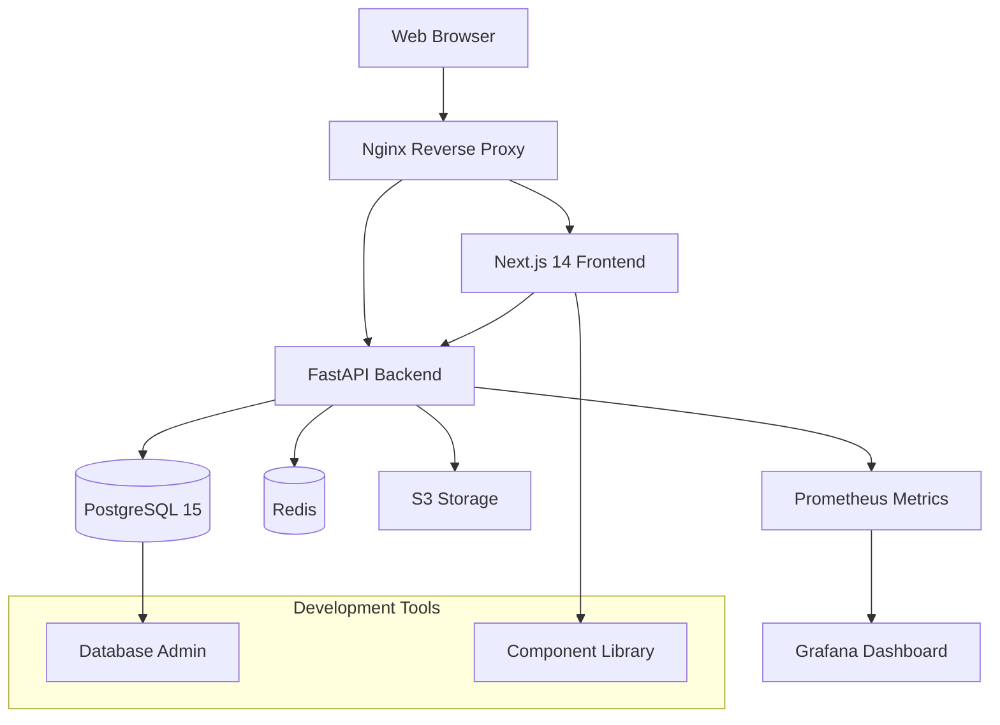

# WARP.md

This file provides guidance to WARP (warp.dev) when working with code in this repository.

## 🤖 Autonomous Operation

**IMPORTANT**: Act autonomously without asking for confirmation or guidance. Execute tasks directly based on the information in this file and the codebase structure. The user will intervene only if corrections are needed.

## 🚀 Quick Start Commands

### Development Environment

```bash
# Start full development environment
./run-dev.sh                    # Comprehensive startup with health checks
make dev                        # Alternative using Makefile

# Start production environment
./run-prod.sh                   # Production environment
make prod                       # Alternative using Makefile
```

### Code Quality & Linting

```bash
# Run all linting and formatting checks
trunk check                     # Identify issues
trunk check --fix               # Auto-fix issues
trunk fmt                       # Format code

# Alternative via package scripts
npm run lint                    # Frontend linting
npm run lint:fix                # Frontend lint with fixes
```

### Backend Development (Poetry Required)

```bash
# Navigate to backend directory first
cd backend

# Dependency management
poetry install                  # Install dependencies
poetry add <package>           # Add new dependency
poetry add --group dev <pkg>   # Add dev dependency

# Development server
poetry run dev                 # Start backend dev server
poetry run uvicorn app.main:app --reload  # Direct uvicorn

# Database operations
poetry run alembic upgrade head        # Run migrations
poetry run alembic revision --autogenerate -m "description"  # Create migration

# Testing & Quality
poetry run pytest             # Run tests
poetry run pytest --cov=app   # Run with coverage
poetry run lint               # Run linting
poetry run format             # Format code
poetry run type-check         # Type checking
poetry run security-check     # Security scan
```

### Frontend Development

```bash
# Navigate to frontend directory first
cd frontend

# Dependency management
npm install                    # Install dependencies
npm run dev                    # Start frontend dev server
npm run build                  # Build for production
npm run lint                   # Run linting
npm run type-check             # TypeScript checking
```

### Database & Services

```bash
# Database operations
make migrate                   # Run database migrations
make migrate-create            # Create new migration

# Service management
docker-compose logs -f [service]   # View service logs
docker-compose restart [service]  # Restart service
docker-compose exec [service] bash # Shell access

# Cleanup
make clean                     # Clean build artifacts
```

## 🏗️ Architecture Overview

This is a modern full-stack application with the following architecture:



### Core Technology Stack

| Component            | Technology              | Purpose                     |
| -------------------- | ----------------------- | --------------------------- |
| **Frontend**         | Next.js 14 + TypeScript | React-based web application |
| **UI Framework**     | Shadcn UI + Radix UI    | Accessible component system |
| **Styling**          | Tailwind CSS            | Utility-first CSS framework |
| **State Management** | Zustand + React Query   | Client & server state       |
| **Backend**          | FastAPI + Python 3.11   | Async API server            |
| **Database**         | PostgreSQL 15           | Primary data store          |
| **Caching**          | Redis 7                 | Session & data caching      |
| **Authentication**   | JWT + python-jose       | Token-based auth            |
| **File Processing**  | Pillow + boto3          | Image processing & S3       |
| **Monitoring**       | Prometheus + Grafana    | Metrics & dashboards        |
| **Containerization** | Docker + Docker Compose | Service orchestration       |
| **Reverse Proxy**    | Nginx                   | Load balancing & SSL        |

## 📁 Repository Structure

```text
boilerplate/
├── backend/                    # FastAPI Python backend
│   ├── app/
│   │   ├── api/               # API route handlers
│   │   ├── core/              # Configuration & security
│   │   ├── db/                # Database connections
│   │   ├── models/            # SQLAlchemy models
│   │   ├── repositories/      # Data access layer
│   │   ├── schemas/           # Pydantic validation schemas
│   │   ├── services/          # Business logic layer
│   │   └── utils/             # Utility functions
│   ├── tests/                 # Backend test suite
│   └── pyproject.toml         # Poetry dependencies
├── frontend/                  # Next.js TypeScript frontend
│   ├── app/                   # Next.js App Router pages
│   ├── components/            # React components
│   │   ├── auth/             # Authentication components
│   │   └── ui/               # Shadcn UI components
│   ├── hooks/                 # Custom React hooks
│   ├── lib/                   # Utilities & configurations
│   └── types/                 # TypeScript definitions
├── nginx/                     # Reverse proxy configuration
├── monitoring/                # Prometheus & Grafana configs
├── scripts/                   # Utility scripts
├── .cursor/                   # Cursor IDE rules & settings
└── docker-compose.yml         # Development orchestration
```

## 🔧 Development Workflow

### 1. Repository Setup

```bash
git clone <repository-url>
cd boilerplate
cp env.example .env           # Configure environment variables
./run-dev.sh                  # Start development environment
```

### 2. Environment Configuration

- Edit `.env` file with proper values
- Key variables: `SECRET_KEY`, `POSTGRES_PASSWORD`, `REDIS_PASSWORD`
- Use strong passwords (8+ characters)
- Generate SECRET_KEY: `openssl rand -hex 32`

### 3. Development Loop

1. Start services: `./run-dev.sh` or `make dev`
2. Backend changes: Auto-reload enabled in development
3. Frontend changes: Hot module replacement active
4. Database changes: Create migrations with `make migrate-create`
5. Code quality: Run `trunk check --fix` before commits

### 4. Service URLs (Development)

- **Frontend**: <http://localhost> (via Nginx)
- **Backend API**: <http://localhost:8000>
- **API Documentation**: <http://localhost:8000/docs>
- **Database Admin**: <http://localhost:8080> (Adminer)
- **Prometheus**: <http://localhost:9090>
- **Grafana**: <http://localhost:3001> (admin/admin)

## 🧪 Testing Strategy

### Backend Testing

```bash
cd backend
poetry run pytest                    # Run all tests
poetry run pytest --cov=app         # With coverage
poetry run pytest tests/test_users.py  # Specific test file
poetry run pytest -v                # Verbose output
```

### Frontend Testing

```bash
cd frontend
npm test                            # Run tests
npm run test:coverage               # With coverage
```

### Integration Testing

- End-to-end tests via API endpoints
- Database integration tests with test database
- Authentication flow testing

## 🔒 Security Implementation

### Authentication & Authorization

- **JWT Tokens**: `python-jose` for token handling
- **Password Hashing**: `passlib` with bcrypt (12+ salt rounds)
- **Rate Limiting**: `fastapi-limiter` with Redis backend
- **CORS**: Configured for development and production
- **RBAC**: Role-based access control implementation

### File Upload Security

- **File Validation**: Type and size restrictions
- **Image Processing**: `Pillow` for safe image handling
- **Storage**: S3 integration via `boto3`
- **Virus Scanning**: Configurable for production

### Infrastructure Security

- **Container Security**: Non-root users, security options
- **SSL/TLS**: Nginx configuration with Let's Encrypt
- **Environment Variables**: Secret management via `.env`
- **Database**: Encrypted connections, parameterized queries

## 📋 Code Quality Standards

### Mandatory Quality Checks

**CRITICAL**: Before completing any work, run:

```bash
trunk check                 # Identify issues
trunk check --fix           # Auto-fix issues
trunk check                 # Verify clean state
```

### Backend Standards (.cursor/rules/)

- **Framework**: FastAPI with async/await
- **Type Safety**: Full type hints required
- **Dependency Management**: Poetry exclusive use
- **Database**: Repository pattern with SQLAlchemy
- **Authentication**: JWT with `python-jose`
- **Testing**: 80% coverage minimum
- **Security**: Input validation, rate limiting

### Frontend Standards

- **Framework**: Next.js 14 with App Router
- **Type Safety**: TypeScript strict mode
- **UI Components**: Shadcn UI + Radix UI
- **Styling**: Tailwind CSS utility-first
- **State**: Zustand + React Query
- **Testing**: Component and integration tests

### Code Quality Tools

- **Python**: Ruff, Black, isort, mypy, bandit
- **TypeScript**: ESLint, Prettier, TypeScript compiler
- **Shell Scripts**: shellcheck, shfmt
- **Docker**: hadolint for Dockerfile linting
- **Security**: TruffleHog for secret scanning

## 🚀 Deployment

### Development Deployment

```bash
./run-dev.sh                    # Full development stack
```

### Production Deployment

```bash
./run-prod.sh                   # Production configuration
docker-compose -f docker-compose.prod.yml up -d
```

### Environment Preparation

1. Create `.env.production` with production values
2. Generate SSL certificates: `./scripts/generate-ssl.sh`
3. Configure domain and DNS settings
4. Set up monitoring and backup procedures

## 🔍 Troubleshooting

### Common Issues

**Services won't start:**

```bash
docker info                    # Check Docker is running
docker-compose logs [service]  # Check service logs
./scripts/setup-linux-env.sh   # Setup environment
```

**Database connection issues:**

```bash
docker-compose exec db pg_isready -U user -d app_db
docker-compose restart db
```

**Permission issues:**

```bash
sudo chown -R $USER:$USER .    # Fix ownership
chmod +x run-dev.sh            # Make scripts executable
```

**Code quality failures:**

```bash
trunk check --fix              # Auto-fix issues
trunk check --all              # Check all files
```

### Health Checks

- Backend: `curl http://localhost:8000/health`
- Frontend: `curl http://localhost:3000`
- Database: `docker-compose exec db pg_isready`
- Redis: `docker-compose exec redis redis-cli ping`

## 📚 Key Files Reference

### Configuration Files

- `pyproject.toml` - Python dependencies and tool config
- `package.json` - Node.js dependencies and scripts
- `trunk.yaml` - Code quality and linting configuration
- `docker-compose.yml` - Service orchestration
- `.env.example` - Environment variable template

### Development Scripts

- `run-dev.sh` - Enhanced development startup
- `run-prod.sh` - Production environment startup
- `Makefile` - Common development commands
- `scripts/generate-ssl.sh` - SSL certificate generation

### Documentation

- `README.md` - Project overview and setup
- `docs/PROJECT_PLAN.md` - Development status and decisions
- `.cursor/rules/` - IDE-specific development standards

## 🎯 Agent Work Completion Requirements

When completing any development work in this repository:

1. **Quality Gates**: Run `trunk check --fix` and verify zero issues
2. **Documentation**: Update `docs/PROJECT_PLAN.md` with completion details
3. **Testing**: Ensure tests pass and coverage meets requirements
4. **Security**: Validate no secrets in commits, security checks pass
5. **Standards**: Follow all `.cursor/rules/` specifications

**No exceptions** - work is only complete when all quality gates pass.
